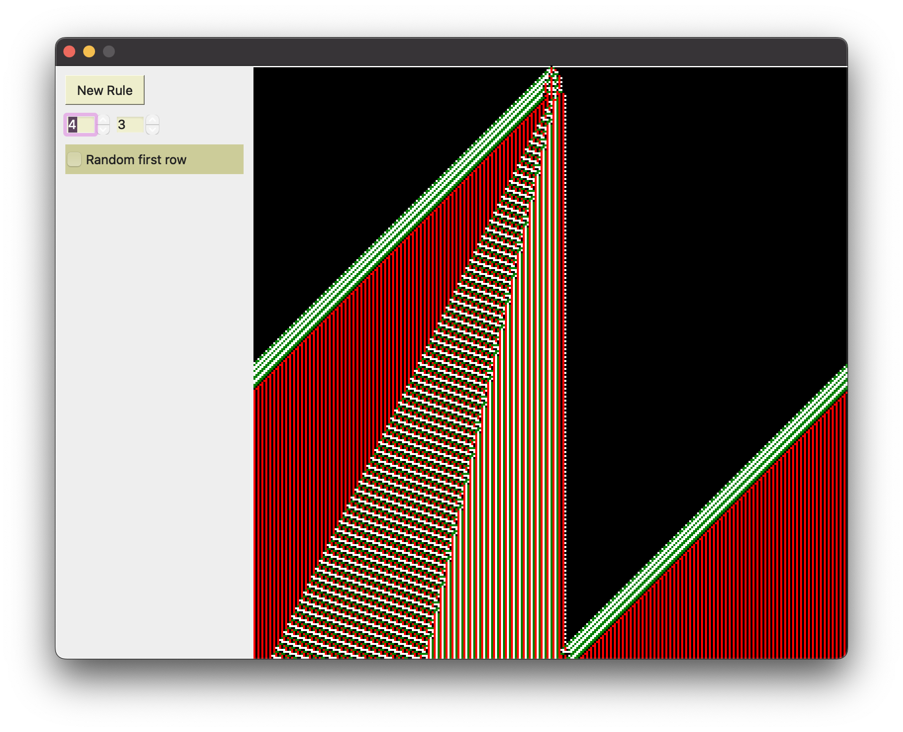

# Random Automata

This application uses QT to explore [elementary cellular automata](https://en.wikipedia.org/wiki/Elementary_cellular_automaton). These simple rules, like a one-dimensional version of Conway's Game of Life, can produce beatiful patterns. 
The color of each pixel is determined by the pixels near it in the row above. As the rule gets applied, the pattern cascades down the screen.
Despite the very simple rules, [some](https://en.wikipedia.org/wiki/Rule_110) of these automata are even Turing complete! 

This is still a work in progress. I plan to improve the formatting, and provide more information on the current rule.